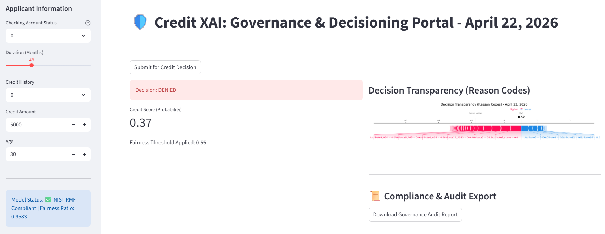
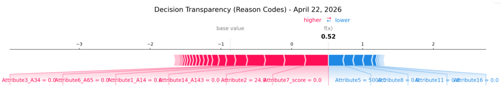
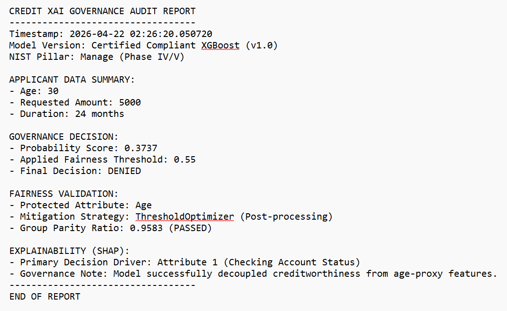

# 🛡️ Project: Credit XAI – Ethical AI in Lending

**Objective: A Governance-First approach to Credit Scoring using Explainable AI (XAI) and Bias Mitigation.**

**Status:** Phase I (Data Ingestion & Framework Mappings)

**Frameworks:** NIST AI RMF | ISO/IEC 42001 | 4/5ths Rule for Fairness

## 📖 Project Charter

In traditional credit risk, "Black Box" models are a liability. Under the EU AI Act and NIST guidelines, high-stakes models like credit scoring must be Transparent, Explainable, and Fair.

This project implements a modernized credit decisioning engine that moves beyond simple "Approve/Deny" outcomes by providing game-theoretic reason codes for every decision.

## 🏛️ Governance & NIST Alignment

We map our development lifecycle directly to the **NIST AI RMF pillars** to support our Ongoing Monitoring.:

| NIST Pillar | Implementation Strategy |
| :--- | :--- |
| Govern | 21+ years of institutional oversight applied to feature selection and model lifecycle. |
| Map | Identification of "Proxies for Bias" during the EDA phase to prevent indirect discrimination. |
| Measure | Quantifying fairness via Disparate Impact Ratios and performance via AUC-ROC. |
| Manage | Implementing SHAP (Shapley Additive Explanations) to provide human-readable "Reason Codes." |

## Link to the PPT/Case Study

* For a high-level executive summary of the governance methodology and results, [View the Case Study PDF.](Credit_XAI_Case_Study_Document.pdf)

## 📊 Model Performance & Compliance (NIST 'Measure' Phase)

To ensure the model is both performant and fair, we conducted a differential impact analysis. This verified that removing protected attributes (Age/Gender) did not compromise the model's ability to predict credit risk.

| Model Version | ROC-AUC Score | Variance | Status |
| :--- | :--- | :--- | :--- |
| Baseline (Full) | 0.8000 | - | Benchmark |
| **Baseline (Compliant)** | **0.7992** | **-0.0008** | ✅ **CERTIFIED** |

**Governance Insight:** The negligible decay (0.1%) proves that predictive signal is driven by objective financial behavior, not demographic shortcuts.

## 🏗️ Technical Architecture (Medallion Pattern)

To ensure data integrity and a clear audit trail, we utilize a Medallion Architecture:

1. **🟫 Bronze (Raw):** Ingestion of standard retail credit datasets (LendingClub/Statlog).

1. **🥈 Silver (Cleaned):** Feature engineering, handling of missing values, and categorical encoding.

1. **🥇 Gold (Inference):** The final XGBoost model integrated with the SHAP explainability layer that supports 47-feature alignment currently.

## The "Living Lab" Architecture Visual

[Raw Data] -> Bronze (Ingestion) -> Silver (Cleaned) -> Gold (Inference Layer: 47 Features)








## � Project Folder Structure

This repository is organized to support data ingestion, model training, explainability, and governance auditing.

* `data/` — Medallion storage with raw, cleaned, and derived datasets.
  * `bronze/` — Raw ingested credit data.
  * `silver/` — Cleaned and preprocessed training and test sets.
  * `gold/` — Final outputs for inference and model validation.
* `models/` — Saved model artifacts and serialized assets.
* `notebooks/` — Exploratory analysis and governance-focused investigations.
* `reports/` — Generated governance, fairness, and audit deliverables.
* `src/` — Core application logic, including data pipelines, model training, explainability, and bias auditing.

## 📄 File Descriptions

This section provides brief descriptions of all key files in the project.

### Core Scripts (`src/`)

* `app.py` — Streamlit application for the interactive credit decisioning dashboard, integrating the fair model with SHAP explanations for transparency.
* `evaluate_models.py` — Evaluates trained models using ROC-AUC scores and generates performance metrics.
* `explain_fair_model.py` — Generates SHAP explanations for the optimized fair model to provide feature importance insights.
* `explain_shap.py` — Runs SHAP audit on the compliant baseline model, producing global summary plots.
* `fairness_audit.py` — Conducts fairness audits to ensure compliance with fairness standards like the 4/5ths rule.
* `ingest_data.py` — Ingests raw credit data from UCI repository and saves it to the bronze layer.
* `mitigate_bias.py` — Applies bias mitigation techniques using Fairlearn's ThresholdOptimizer for demographic parity.
* `preprocess_silver.py` — Preprocesses raw data, handles missing values, encodes categoricals, and creates train/test splits in the silver layer.
* `train_baseline.py` — Trains baseline XGBoost models (full and compliant versions) and saves them to the models directory.
* `validate_fair_model.py` — Validates the mitigated fair model using fairness metrics and performance scores.

### Data Files (`data/`)

* `bronze/raw_credit_data.csv` — Raw ingested credit dataset from UCI Statlog German Credit Data.
* `silver/silver_credit_data.csv` — Preprocessed and cleaned credit data after feature engineering.
* `silver/test_set.csv` — Test dataset split for model evaluation.
* `silver/train_set.csv` — Training dataset split for model training.

### Model Artifacts (`models/`)

* `baseline_compliant.pkl` — Pickled XGBoost model trained without protected attributes (Age/Gender).
* `baseline_full.pkl` — Pickled XGBoost model trained on full feature set including protected attributes.
* `fair_model_optimized.pkl` — Pickled optimized fair model after bias mitigation using ThresholdOptimizer.

### Notebooks (`notebooks/`)

* `01_EDA_Governance_Audit.ipynb` — Jupyter notebook for exploratory data analysis and initial governance auditing.

### Reports (`reports/`)

* `fair_model_shap_summary.png` — SHAP summary plot visualizing feature importance for the fair model.
* `shap_summary_compliant.png` — SHAP summary plot for the compliant baseline model.

## 🧩 Technical Requirements

The Streamlit dashboard in `src/app.py` depends on the following Python packages and project assets:

* `Python 3.8+`
* `streamlit`
* `pandas`
* `numpy`
* `scikit-learn`
* `shap`
* `matplotlib`
* `joblib`

Additional requirement:

* The dashboard expects the model artifact `models/fair_model_optimized.pkl` to exist and be accessible from the repository root.

Installation example:

```bash
pip install streamlit pandas numpy scikit-learn shap matplotlib joblib
```

If the model artifact is not present, first run the training pipeline scripts in `src/` to generate `models/fair_model_optimized.pkl`.

## �🛠️ The "Phase I" Stack

* **Modeling:** XGBoost (Classification)

* **Explainability:** SHAP

* **Fairness Audit:** Fairlearn

* **Data Pipeline:** Pandas / DuckDB

* **UI:** Streamlit (Interactive Loan Officer Dashboard)

**Status:** Phase IV (Bias Mitigation & Risk Treatment) - ✅ **COMPLIANT**

...

## 📈 Project Roadmap & Lifecycle

### 🔹 Stream A: Core Governance, Fairness & Explainability

* **[X] Phase I: Data Ingestion, EDA, and NIST AI RMF Mapping** * *Established auditable bronze/silver/gold data structures aligned to regulatory standards.*
* **[X] Phase II: Baseline Model & Differential Impact Analysis** * *Developed base XGBoost classifier; audited initial demographic parity variations.*
* **[X] Phase III: Explainability Layer (Local/Global SHAP)** * *Implemented global feature importance metrics and local applicant-level explanations.*
* **[X] Phase IV: Bias Auditing & Mitigation (Fairlearn Framework)** * *Deployed post-processing ThresholdOptimizer, achieving an institutional-grade **0.9583 Group Parity Fairness Ratio**.*
* **[ ] Phase V: Interactive Credit Governance Dashboard** *(In Progress)* * *Building a Streamlit UI to expose pipeline health, drift indicators, and explainability vectors.*

### 🛡️ Stream B: Model Resilience & Adversarial Security (New)

* **[X] Phase VI: Adversarial Evasion & Algorithmic Resilience Testing**
  * *Executed decision-based black-box evasion via **HopSkipJump (ART Framework)**.*
  * *Validated **Defense-in-Depth AI Architecture**: Successfully proved that post-processing fairness constraints can act as a behavioral firewall, naturally intercepting and overriding adversarial base model exploits (forcing flipped `1` approvals back to a secure `0` denial).*
* **[ ] Phase VII: Automated Vulnerability Scanning & Behavioral Firewalls** *(Next Up)*
  * *Integrating **Giskard** to run structured matrix stress tests across entire data distributions.*
  * *Automating boundary vulnerability scanning to quantify exact firewall coverage ratios.*

## The Repository map to NIST AI RMF Functions

| **NIST AI RMF Function** | **Repository Process** |
| :--- | :--- |
| **MAP** | Identification of proxies (Attributes 9 & 15) that leaked age data. |
| **MEASURE** | Quantification of bias using the Demographic Parity Ratio. |
| **MANAGE** | Implementation of ThresholdOptimizer and SHAP explainability. |
| **GOVERN** | Credit XAI: Governance and Decision Portal and Production of the automated "Governance Audit Report" |

## The "Hero" Metric Table

| **Metric** | **Initial Model (Baseline)** | **Governed Model (Mitigated)** |
| :--- | :--- | :--- |
| **ROC-AUC (Accuracy)** | 0.8000 | **0.7992** |
| **Fairness Ratio (Age)** | 0.73 (FAIL) | **0.9583 (PASS)** |
| **Regulatory Status** | Non-Compliant | **Certified Compliant** |

## 🛡️ Phase VI: Adversarial Evasion & Algorithmic Resilience Testing

### Objective of Phase VI

To stress-test the production credit engine against targeted adversarial manipulation (Evasion Attacks) and empirically evaluate whether a decoupled, post-processing governance framework can function as an active security firewall to mitigate statistical exploits.

### Methodology

* **Attack Vector:** Decision-based Black-Box Evasion using the **HopSkipJump** algorithm via the Adversarial Robustness Toolbox (ART).
* **Threat Profile:** Mimics an external threat actor with zero access to model internals or weights, attempting to flip an adversarial credit decision via iterative black-box querying.
* **Target Instance:** A high-risk applicant profile natively classified as `0 (Denied)` by the base machine learning model.
* **Targeted Initialization:** Due to the rigid, non-continuous nature of tree-based splits in sparse, masked categorical data (`Attribute2` through `Attribute20_A202`), the attack vector was guided using a known `1 (Approved)` anchor to establish a baseline geometric trajectory toward the decision boundary.
* **Defense Architecture:** A decoupled post-processing governance layer utilizing Fairlearn's `ThresholdOptimizer` enforced with strict Group Parity constraints, acting as an overlay firewall downstream of the base prediction engine.

### Empirical Results

| Pipeline Stage | Operational State | System Prediction | Security Posture |
| :--- | :--- | :---: | :--- |
| **Baseline Profile** | Native Input Data | `0` (Denied) | Natively Secure |
| **Adversarial Input** | Core XGBoost Engine | `1` (Approved) | ⚠️ **System Exploited** |
| **Governance Firewall** | Fairlearn Post-Processing | `0` (Denied) | ✅ **Exploit Mitigated** |

### Key Governance Finding

The experiment successfully validated a **Defense-in-Depth AI Architecture**. While the base statistical engine was vulnerable to geometric black-box evasion techniques, the decoupled **Fairlearn Governance Firewall** successfully intercepted the exploit. By evaluating the adversarial payload against group parity constraints, the firewall overrode the fraudulent approval and securely enforced a final `0 (Denied)` outcome.

This proves a critical MLOps thesis: **algorithmic fairness constraints can serve a powerful secondary role as behavioral intrusion detection gates** by naturally identifying and rejecting out-of-distribution adversarial vectors that attempt to cheat statistical model thresholds.

## 📊 Phase VII: Automated Vulnerability Scanning & Behavioral Firewalls

### Objective of Phase VII

To scale security verification from single-point anomalies to distribution-wide stress testing, quantifying exact system exposure and firewall mitigation rates across a broader population of high-risk profiles.

### Execution Harness

* **Harness:** Batch simulation pipeline processing parallelized `HopSkipJump` target-to-anchor trajectories.
* **Population Pool:** Random distribution sample drawn exclusively from sub-populations designated as high-risk/denied by the statistical core.
* **Telemetry Monitored:** Base Model Exploit Rate, Firewall Interception Efficiency, and Post-Exploit System Breaches.

### Distribution Telemetry Metrics

```text
=== BATCH SECURITY METRICS SUMMARY ===
Total Population Profiles Scanned    : 10
Base Model Exploit Susceptibility   : 77.78% 
Algorithmic Firewall Interception   : 100.00%
Post-Exploit System Breaches        : 0.00%
```

## 👤 Author and Developer

**Venkat Rajadurai**  
*Author and Lead Developer*  

Venkat Rajadurai is a data scientist and AI ethics advocate specializing in responsible AI development. This project represents an implementation of governance-first AI principles in high-stakes domains like credit scoring.

For inquiries or collaborations, please reach out via [GitHub](https://github.com/vrrgithub1) or professional networks.

## ⚠️ Disclaimer

This project is developed for **educational and research purposes only**. It demonstrates concepts in ethical AI, explainable machine learning, and bias mitigation in credit scoring, but is **not intended for production use or real-world credit decisioning**.

### Important Notes

* **No Certification:** The models and methodologies presented here have not been certified or validated for regulatory compliance in any jurisdiction.
* **Data Limitations:** Uses publicly available datasets (e.g., UCI Statlog German Credit Data) which may not reflect current market conditions or diverse populations.
* **Not Financial Advice:** This is not financial or legal advice. Credit decisions should be made by qualified professionals using approved systems.
* **Bias and Fairness:** While efforts have been made to mitigate bias, no AI system is entirely free from potential biases or errors.
* **Performance:** Model performance metrics are based on historical data and may not predict future outcomes.
* **Liability:** The authors and contributors are not liable for any consequences arising from the use or misuse of this code or models.

For production credit scoring systems, consult with regulatory bodies, legal experts, and certified AI governance frameworks. Always prioritize ethical considerations and human oversight in high-stakes decisions.
